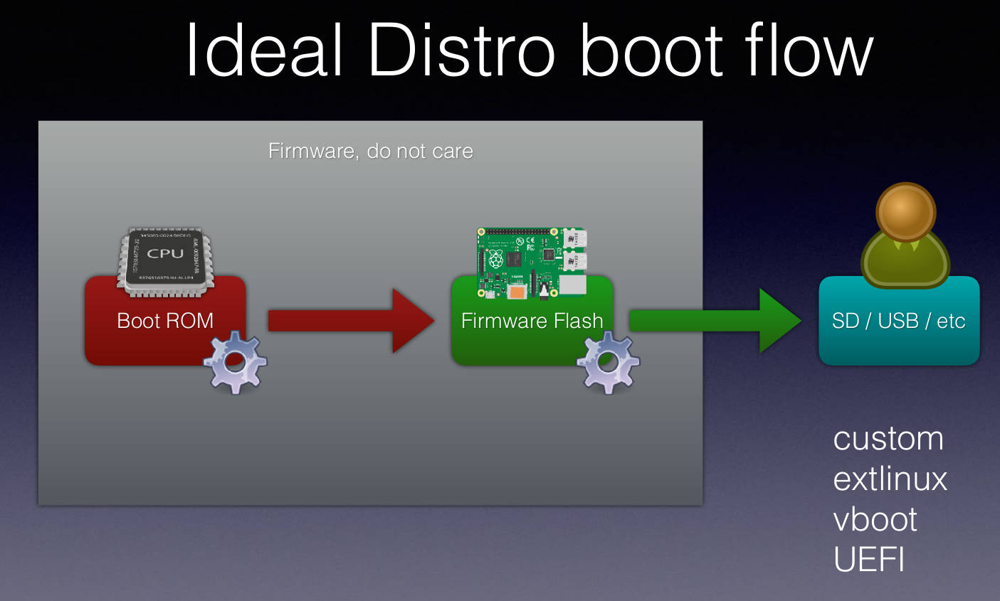
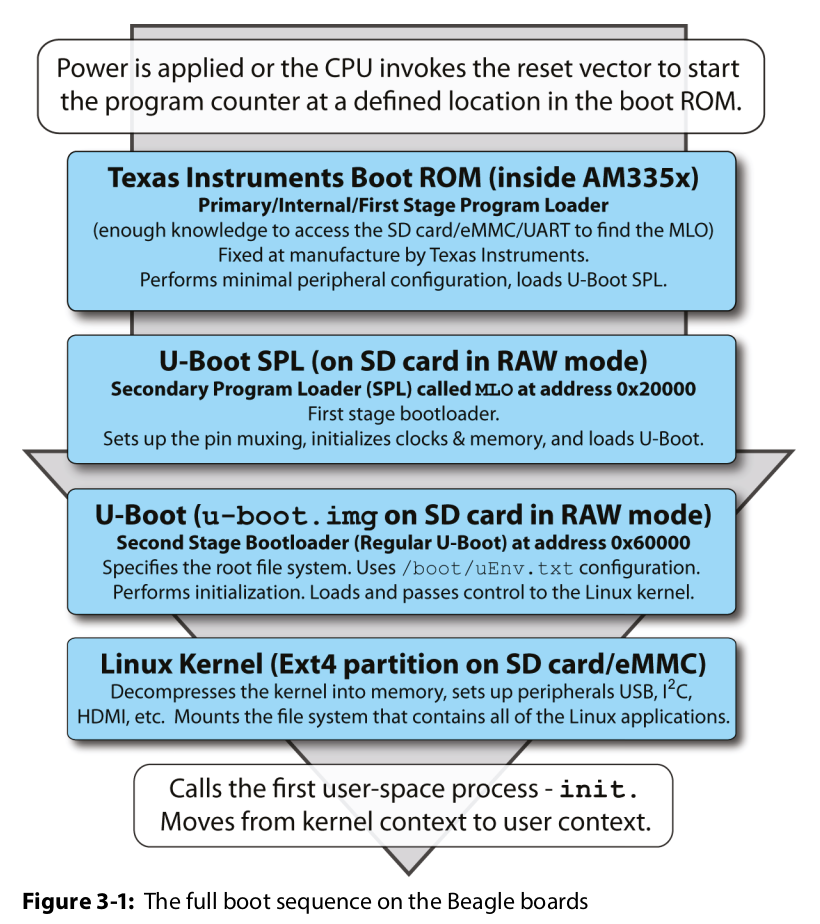

# The booting process: UEFI, U-Boot, GRUB

In this document I will try to summarize all the buzzwords and magic related to the act of booting a device and getting the OS ready.

## UEFI: Unified Extensible Firmware Interface

Let's get it out of the way first. The BIOS (Basic Input Output System) is the precursor of the UEFI interface, and the latter is backward compatible with it.

So, the most basic boot sequence works like this:

1. You have your boot code in the ROM. It will normally be an architecture dependent assembly file, like `arch/arm/cpu/armv7/start.S` or `arch/powerpc/cpu/mpc83xx/start.S`.

2. You put that code somewhere volatile (RAM, Flash), where it can be executed. The boot code then initializes the most basic peripherals, like the CPU clock, the system memory, the stack, the keyboard, the SD card and the USB. Anything that is needed to "start" the board.

3. The firmware then starts the UEFI program, which searches the *block devices* (SD card, HDD, USB sticks) for any extendable firmware image (".efi" file), loads it into the RAM, and gives up the resources to it.



The UEFI is an standardized version of the firmware needed to boot the device. It's present at the board in NVRAM (Non Volatile RAM), and has a table with possible bootable files and devices. In the image below, we can see that it first searches for the file "sda2/foo.efi", then for "mmc0/bar.efi" and so on. 

To do this, the *block devices* must have been already initialized. That code is not part of the UEFI. The UEFI protocol is hardware agnostic, therefore, it must be provided by the board manufacturer.


In case of not finding any bootable devices, the UEFI enters the "removable" mode, where it starts searching for standard devices and file names from removable devices.


After finding the ".efi" image, it will continue the boot process.

### EFI Runtime: GRUB and others

Once the ".efi" file is found, it will be executed. This file isn't the Linux kernel, but rather a simplified operating system. The most common example is the GRUB (GNU GRand Unified Bootloader), which is a file named **grubx64.efi**. So, the capabilities of the EFI Runtime are:
* Provide a Console for the user, or some kind of interactive I/O interface (for example, the BIOS console or the UEFI console that can be loaded before loading the OS, pressing something like "F12" or "F2").
* Provide *boot services*: It allows communicating with the different devices, perform a hardware check, and boot the Linux Kernel.
* Runtime services: The UEFI and the OS establish a bidirectional channel of communication. The UEFI can provide access to the RTC (Real Time Clock), and the OS can change the order of the bootable devices to consult, for example.
* Tables: Extra information about the hardware or for the OS can be stored inside tables. The most remarkable one is the **FTD (Flattened Device Tree)**, which is a standardized way to tell the kernel about the hardware devices present on the board.


After the operating system is booted, normally the ".efi" program is discarded, and only remains a bidirectional communication between the OS and the UEFI.


## Das U-Boot

So far, we have talked about how the UEFI does this and that. Where can I download the UEFI?

Well, the UEFI is an **specification**, not an implementation. The guys that made the UEFI wrote an implementation, called [tianocore](https://www.tianocore.org/). However, the most used implementation of UEFI is by far [U-Boot](https://github.com/ARM-software/u-boot/tree/master).

The UEFI interface functions, variables and names used to communicate with block devices look something like this:

```c
u32 block_size;
u64 last_block;
char read_only;
read_block();
write_blocks();
```

Meanwhile, the API from U-Boot looks like this:

```c
ulong blksz;    //(block size)
u64 lba;        //(last block active)
char removable;
blk_dread();
blk_dwrite();
```

Since the API is very similar, normally an *efi_loader* is written, that parses both interfaces, so that the OS can call any of those indistinctly.

### From U-Boot to Linux Image

The block devices and basic I/O have been set up. The U-Boot boot-loader is running and presents to you a terminal. Now, we should load the Linux Kernel image from the disk to the RAM, and execute it. This process is called **bootefi**.

```bash
# Load from MMC (MultiMedia Card, SD) the kernel Image
U-Boot > load mmc 0:1 $kernel_addr_r Image

# Boot the Linux Kernel, specifying the address and the FDT (Flattened device tree, which describes the hardware).
U-Boot > bootefi $kernel_addr_r $fdt_addr_r
```

Of course, we don't want to type that manually every time the system wants to boot. Therefore, U-Boot has what's called *distro boot*. Provided a list of devices to boot from:  `boot_targets = mmc0 usb0 pxe dhcp`, it will search automatically for the files that it needs on default paths (GRUB file, FDT file, Linux Kernel image), for example: `efi/boot/bootaa64.efi` (this is the GRUB executable).

## Study Case: The BeagleBone Black

So, let's review the booting process of the BeagleBone Black, and go over all these  previous topics.

1. The first step consist on giving power to the board, and executing the code in the reset vector of the device. This code is provided by Texas Instruments, and performs the bare minimum initialization to be able to read the SD card, UART, etc; and find the bootloader image.
2. A "first stage bootloader" is called, and then the proper U-Boot image is called. Both of them perform the coarse of the hardware initialization. Some of this initialization can be configured within the file `/boot/UEnv.txt` present on the SD card.
3. Finally, the Linux Kernel image is loaded into RAM from `/boot/vmlinuz-*`, all the resources are given up to it, and the boot process completes.


The BeagleBone has two devices where it can boot from: the SD card or the eMMC (embedded MultiMedia Card). They can be interchanged by pressing the "boot" button on the board. To flash the Linux Kernel inside the eMMC, uncomment the following line inside the `/boot/uEnv.txt` file:

```bash
##enable Generic eMMC Flasher:
##make sure, these tools are installed: dosfstools rsync
#cmdline=init=/opt/scripts/tools/eMMC/init-eMMC-flasher-v3.sh
```

Some helper scripts written by the BeagleBone developers can be found inside the folder `/opt/scripts/tools`.

## References

* [Marrying U-Boot_UEFI_and_grub: The Linux Foundation](https://www.youtube.com/watch?v=qJAkJ3nmWgM&ab_channel=TheLinuxFoundation)
* [U-Boot: GitHub](https://github.com/ARM-software/u-boot/tree/master)
