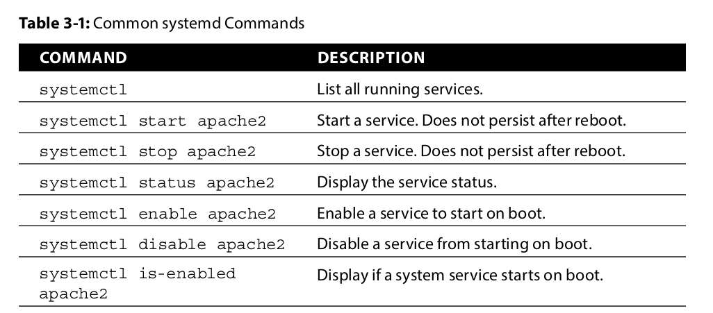
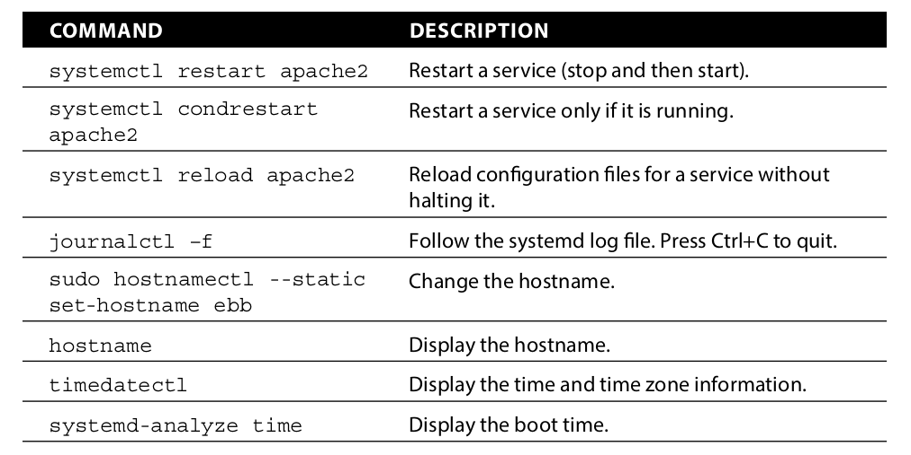

# Embedded Linux

This file will cover several topics related to embedded Linux, using the BeagleBone Black (BBB) with a Debian distribution.

# udev rules
Se usan para cambiar el grupo al que perteneces los dispositivos, y los permisos de ejecución. Se encuentran en la carpeta `/etc/udev/rules.d`.

```txt
# /etc/udev/rules.d/80-gpio-noroot.rules
#
# ReWritten by: Matthijs van Duin
# Corrects sys GPIO permissions on the BB so non-root users in the gpio group can manipulate bits
#
SUBSYSTEM=="gpio", ACTION=="add", \
        RUN+="/bin/chgrp -R gpio '/sys%p'", \
        RUN+="/bin/chmod -R g=u '/sys%p'"
```

Se puede poner un bit de "sudo" en los permisos de un binario, haciendo que ese archivo siempre se ejecute con permisos de root.
## clase

El driver se ubica en el kernel, y le proporciona al usuario una API para abstraerse del hardware.

Kernel monolítico: único código objeto. Requiere recompilar.

MicroKernel: Modular (servicios), overhead debido a IPC.

LKM Linux Kernel Module

BSP: Board Support Packages

Es un conjunto de bibliotecas que ofrecen una capa de abstracción del hardware al Kernel (ejemplo CMSIS de STM). Es la interface del Kernel a los Device Drivers.

SYSFS: Linux Device Model (sistema de archivos virtual empezado en /sys).

Standard devices: se auto descubren y enumeran: USB, PCI (mouse). El periférico envía su configuración y se "presenta", por así decirlo.

Platform devices: requieren intervención de configuración externa. Módulos de un SoC.

El bootloader acaba de copiar el Kenrel de Linux a la SDRAM. Luego, le transfiere el control al entrypoint y en ese momento el Kernel arranca de cero, como una aplicación bare-metal. Debería configurar todos los dispositivos (procesador, memoria virtual, monitor, etc).

Solución: Device Tree:

Contiene una descripción completa del hardware.

En una PC, el DTB viene de la BIOS.

API de acceso al DTS:

(cómo acceder)

* of_address_to_resource

* of_property_read_string


Para la guía:

Revisar el manual de referencias del AM335x, sección 21.3.15. How to program I2C.

* Tabla 2-2, L4_WKUP
* Tabla 2-3, L4_PER
* Tabla 21-8, I2C Registers

Hojas de datos del SHT3x-Dis

PPT Linux Device Drivers

El kernel es el núcleo del sistema del SO. Las aplicaciones accededn a través de syscalls, definida en un área de memoria separada privilegeada "kernel-space"

Definiciones del SYSFS:

Class: dispositivo que se espera que funcione de 

device

bus

driver

LKM son piezas de código que se agregan al kernel en runtime. Agregan o quitan funcionalidad al kernel en tiempo de ejecución. En el tp vamos a escribir un LKM para el driver por I2C.

Los drivers se clasifican en:

* Char device: stream de bytes (open, close, read, write).

* Network device

* Block device

Para cargar el driver, ejecutar en consola con root: `insmod` `rmmod`

```c
#include <linux/init.h>
#include <linux/module.h>

static int hello_init(void) {
    printk(KERN_ALERT, "Hello world\n");
    return 0;
}

module_init(hello_init);
module_exit(hello_init);
```


## systemctl and systemd

systemd es un "system and service manager". Se encarga de arrancar y detener los servicios que corren en segundo plano (web server, ssh server, daemons, etc).

Lista de comandos con systemctl:




